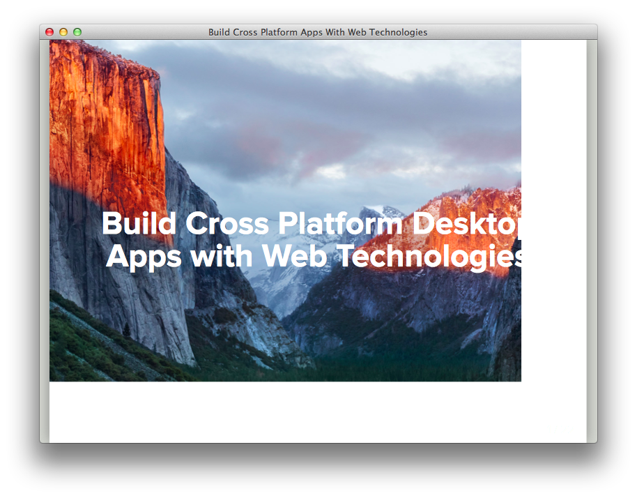

class: center, middle, cover
background-image: url(../assets/images/cover.jpg)

# Build Cross Platform Desktop Apps with Web Technologies

---

class: center, middle

# Is Web Application Superior?

---

class: center, middle

# Is Desktop Software Dead?

---

class: center, middle

# Web App vs. Desktop App

---

# Advantages of desktop apps

* Responsiveness
* Reduced Hosting Costs
* Better Access to Hardware
* Better Development Tools
* Psychological
* Privacy
* Availability
* Connectivity

---

# Advantages of web apps

* Zero Install & Deployment
* Reduced Cost
* Centralised Data
* Availability
* Always Up-to-date
* Cross Platform
* Mobile Adaptation    

---

class: center, middle, machine

## Web App
## v
### Wrapper / Packager / Builder
## v
## Desktop App

---

# Tools

* Electron (NodeJS Based) ([http://electron.atom.io](http://electron.atom.io))
* PHP Nightrain (PHP Based) ([http://www.naetech.com/php-nightrain](http://www.naetech.com/php-nightrain))

---

# Electron

* Chromium and Node.js app-based
* Open Source
* Cross Platform
* Automatic Updates
* Crash Reporting
* Windows Installers
* Debugging & Profiling
* Native Menus & Notification

---

# Example Apps

* Atom
* Slack
* Visual Studio Code
* ..and many more

---

# Electron: Quick Started

Install the `electron` command globally

```bash
npm i electron-prebuilt -g
```  


Install as a development dependency

```bash
npm i electron-prebuilt --save-dev
```

---

# Electron: Create Your First App

Create App Folder

```bash
$ mkdir your-electron-app && cd your-electron-app
``` 

Initialization

```bash
$ npm init
``` 

Install Electron Module 
```bash
$ npm i electron-prebuilt --save-dev
``` 

---

# Electron: Skeleton App

Generally, an Electron app would be structured like this:

```bash
your-electron-app/
├── package.json (*) 
├── index.js (*)
└── index.html
```

(*) will generated automatically

Format of `package.json`

```json
{
  "name": "MyApp",
  "version": "1.0.0",
  "description": "",
  "main": "index.js",
  "scripts": {
    "start": "electron ."
  },
  "author": "",
  "license": "ISC"
}
```

---

# Electron: Simple App

`main.js` contents will be

```js
var app = require('app');
var BrowserWindow = require('browser-window');

app.on('ready', function(){
    var mainWindow = new BrowserWindow({
        width: 800, height: 600
    })
    mainWindow.loadUrl('file://' + __dirname + '/index.html');
})
```

---

# Electron: Simple App

`index.html` contents will be

```html
<html>
    <head></head>
    <body>
        <h1>Hello World from Electron!</h1>        
    </body>
</html>
```

---

# Electron: Runnnnnnnnnnning the App

Commands for running your app

```bash
$ npm start
```

or

```bash
$ electron .
```

---

# ...and TADA!

This is your very first desktop app :* alhamdulillah 


---

class: center, middle

## is it very simple?

---

# PHP Nightrain

* PHP Nightrain is a packager written in Python for the PHP Programming Language.

* Using this tool you can convert your PHP/HTML/CSS/Javascript application to a Native Desktop Application.

* Currently, PHP Nightrain supports the Windows, Mac (OS X) and the Linux operating systems.

---

# Nightrain: Features

* PHP 5 Pre-compiled
* Option to use your own PHP
* GUI rendering your PHP/HTML Web Application
* Set custom width and height
* Start application Maximized/Fullscreenif required
* Window Title changes as the value of the title tag changes
* executable for Windows, Mac, and Linux

---

# Nightrain: Getting Started

Clone and Compile manually

```bash
$ git clone git@github.com:naetech/nightrain.git
```

or download the pre-compiled app at their website :))

```bash
http://www.naetech.com/php-nightrain
```

---

# Nightrain: Dependency

* Python
* wxPython
* PyInstaller
```bash
$ git clone https://github.com/pyinstaller/pyinstaller
```

---

# Nightrain: Compile and Build

The boilerplate app can get from

```bash
$ git clone git@github.com:naetech/nightrain.git
```

and you can compile or build it 

```bash
$ cd your-php-app
$ python build.py install
```

---

# Nightrain: Compile and Build

... and the compiled app is located under directory

```bash
/dist/your-app.app
```

---

# Nightrain: Run your app

Just double click the executable files and TADA!



---

class: center, middle

# Coming Soon

### Packaging and Distributing the Apps

---

# Reference

* electron.atom.io
* naetech.com/php-nightrain
* google.com
* youtube.com
* 9gag.com
* internet-positif.org

---

class: center, middle, cover, thanks
background-image: url(../assets/images/wallpaper-miyabi.jpg)

# arigatou gozaimashita

